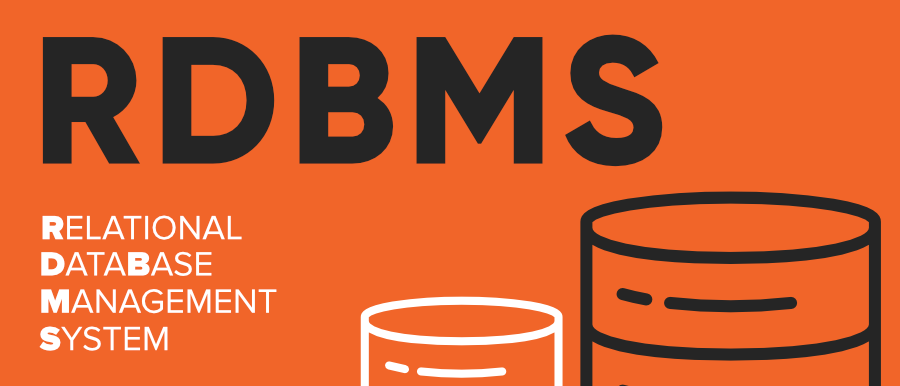
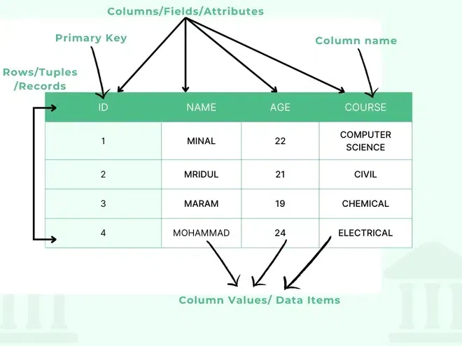
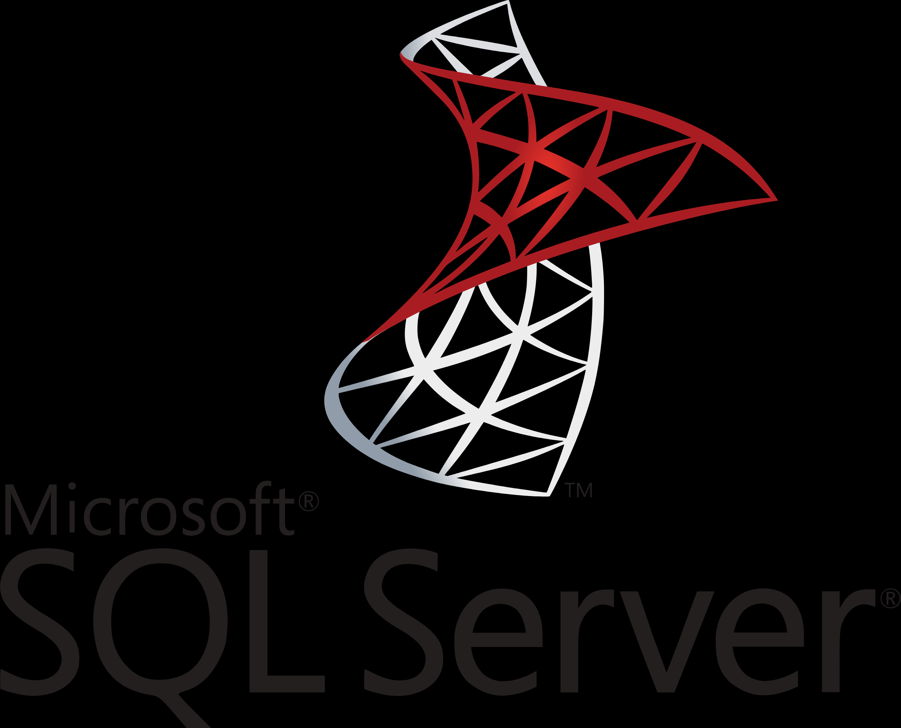

# Databases

A database is a structured collection of data stored on a computer. It is a powerful tool for storing and organizing data efficiently.

Today, you can find databases everywhere, from your smartphone to your computer to the online services you use.

Here are some main features of databases:

* **Efficient data storage** : Databases offer a central location to store structured data such as sales, inventory, and finance.
* **Fast data retrieval** : Databases allow you to access information quickly, much faster than reading data stored on spreadsheets and other flat files.
* **Efficient data management** : Databases allow you to quickly insert, update, and delete data.
* **Data Sharing** : Databases enable multiple users and applications to access the central information simultaneously.
* **Data analysis** : Databases provide the structure to analyze the data and gain valuable insights.

### Types of Databases

* **Relational database management systems** ( **RDBMS** ): This is the most common database type, organizing data into tables with rows and columns. The popular RDBMS are PostgreSQL, MySQL, MariaDB, Oracle Database, SQL Server, and IBM Db2.
* **Document databases** (or NoSQL databases): These types of database stores data as documents. The popular document databases are MongoDB, Databricks, and Amazon DynamoDB.
  

# Relational Database Management Systems

****RDBMS**** stands for ****Relational Database Management Systems.**** A database is an organized collection of data stored in a computer system and usually controlled by a database management system (DBMS). The data in common databases is modeled in tables, making querying and processing efficient.

## What is a Database Table?

A table is a ****collection of related data**** in an organized manner in the form of rows and columns. It is an organized arrangement of data and information in **tabular form** containing rows and columns, making it easier to understand and compare data.

## Features of RDBMS

* Data must be stored in tabular form in DB file, that is, it should be organized in the form of rows and columns.
* Each row of table is called [record/tuple](https://www.geeksforgeeks.org/dbms/tuple-in-dbms/) . Collection of such records is known as the cardinality of the table
* Each column of the table is called an attribute/field. Collection of such columns is called the arity of the table.
* No two records of the DB table can be same. Data duplicity is therefore avoided by using a candidate key.
* Tables are related to each other with the help for foreign keys.

# What is SQL

SQL is a standard language for accessing and manipulating databases.

SQL stands for Structured Query Language

SQL lets you access and manipulate databases

## What Can SQL do?

* SQL can execute queries against a database
* SQL can retrieve data from a database
* SQL can insert records in a database
* SQL can update records in a database
* SQL can delete records from a database
* SQL can create new databases
* SQL can create new tables in a database
* SQL can create stored procedures in a database
* SQL can create views in a database
* SQL can set permissions on tables, procedures, and views

### SQL consists of three main parts:

* **Data definition language (DDL)** deals with the database structure creation and modification. For example, CREATE TABLE, ALTER TABLE, and DROP TABLE statements.
* **Data manipulation language (DML)** provides statements to query data, such as the [SELECT](https://www.sqltutorial.org/sql-select/) statement, and modify the data like [INSERT](https://www.sqltutorial.org/sql-insert/), [UPDATE](https://www.sqltutorial.org/sql-update/), and [DELETE](https://www.sqltutorial.org/sql-delete/) statements.
* **Data control language (DCL)** includes statements, working with user authorization and security, such as GRANT and REVOKE statements.

# What is SQL Server

SQL Server is a relational database management system (RDBMS) developed and marketed by Microsoft. Also known as **MSSQL Server**

Similar to other RDBMS software, SQL Server is built on top of [SQL](https://www.sqltutorial.org/), a standard programming language for interacting with relational databases.

## Usage of SQL Server

* To create databases.
* To maintain databases.
* To analyze the data through SQL Server Analysis Services (SSAS).
* To generate reports through SQL Server Reporting Services (SSRS).
* To carry out ETL (Extracting, Tranform & Load)) operations through SQL Server Integration Services (SSIS).

  

## Why Learn SQL?

SQL's integration with various technologies makes it essential for managing and querying data in databases. Whether it is in traditional relational databases (RDBMS) or modern technologies such as machine learning, AI and blockchain, SQL plays a key role. It works effortlessly with DBMS to help users interact with data, whether stored in structured RDBMS or other types of databases.

* ****Data Science & Analytics:**** Used for querying large datasets, data cleaning and analysis. Analysts use SQL to generate reports and insights that inform business decisions.
* ****Machine Learning & AI:**** Helps in preparing and managing the data required for training machine learning models and AI algorithms. It is used for data cleaning, transformation, and extraction.
* ****Web Development:**** Used to manage user data, e-commerce transactions, and content management in websites and applications built with frameworks like Django, Node.js, and Ruby on Rails.
* ****Cloud and Big Data:**** SQL is integrated into cloud-based databases (e.g., Amazon RDS, Microsoft Azure SQL) and Big Data platforms (e.g., Apache Hive) to enable seamless data querying and management.
* ****Blockchain and Decentralized Systems:**** In blockchain systems, SQL can be used to manage off-chain data, providing efficient data storage and retrieval alongside decentralized ledger technology

## SQL Server Architecture

SQL Server consists of two main components:

* Database Engine
* SQLOS

### 1. Database Engine

The core component of the SQL Server is the Database Engine, which comprises a relational engine that processes queries and a storage engine that manages database files, pages, indexes, etc.

#### Relational Engine

The Relational Engine contains the components that determine the optimal method for executing a query. It is also known as the query processor.

Some tasks of the relational engine include querying processing, memory management, thread and task management, buffer management, and distributed query processing.

#### Storage Engine

The storage engine is responsible for storing and retrieving data from the storage systems such as disks and SAN.

### 2. SQLOS

Under the relational engine and storage engine lies the SQL Server Operating System, or SQLOS.

SQLOS provides various operating system services such as memory and I/O management, as well as exception handling and synchronization services.

# Microsoft SQL Server Management Studio (SSMS)

To interact with SQL Server, you can use a SQL Server client tool such as SQL Server Management Studio (SSMS) provided by Microsoft.

The SQL Server Management Studio is software for querying, designing, and managing SQL Server on your local computer, a remote server, or in the cloud. It provides you with tools to configure, monitor, and administer SQL Server instances.

## Basic Level Questions

1. **What is the difference between DELETE, DROP, and TRUNCATE commands?**
   * DELETE: Removes specific rows from a table (can use WHERE clause)
   * DROP: Removes the entire table structure and data
   * TRUNCATE: Removes all rows from a table but keeps the structure
2. **Explain the difference between PRIMARY KEY and UNIQUE constraint.**
   * PRIMARY KEY: Uniquely identifies each record, cannot be NULL, only one per table
   * UNIQUE: Ensures uniqueness but allows NULL values, can have multiple per table
3. **What are the different types of SQL commands (DDL, DML, DCL)?**
   * DDL (Data Definition Language): CREATE, ALTER, DROP
   * DML (Data Manipulation Language): INSERT, UPDATE, DELETE, SELECT
   * DCL (Data Control Language): GRANT, REVOKE

## Intermediate Level Questions

4. **What is the difference between INNER JOIN and LEFT JOIN?**
   * INNER JOIN: Returns only matching records from both tables
   * LEFT JOIN: Returns all records from left table and matching records from right table
5. **Explain the concept of database normalization and its types.**
   * Process of organizing data to reduce redundancy
   * 1NF, 2NF, 3NF, BCNF - each with specific rules to eliminate anomalies
6. **What is the difference between a clustered and non-clustered index?**
   * Clustered: Physical ordering of data, one per table
   * Non-clustered: Logical ordering, multiple allowed per table

## Advanced Level Questions

7. **How would you optimize a slow-performing SQL query?**
   * Check execution plan
   * Add appropriate indexes
   * Rewrite complex subqueries as JOINs
   * Use WHERE clauses to filter early
   * Consider partitioning for large tables
8. **Explain ACID properties in database transactions.**
   * Atomicity: All or nothing
   * Consistency: Data integrity maintained
   * Isolation: Concurrent transactions don't interfere
   * Durability: Changes persist after commit
9. **What is the difference between a subquery and a CTE (Common Table Expression)?**
   * Subquery: Query within another query, can be correlated or non-correlated
   * CTE: Temporary named result set, more readable, can be recursive
10. **How do you handle deadlocks in SQL Server?**
    * SQL Server automatically detects and resolves deadlocks
    * Prevention: consistent table access order, shorter transactions
    * Detection: Use SQL Server Profiler or Extended Events
